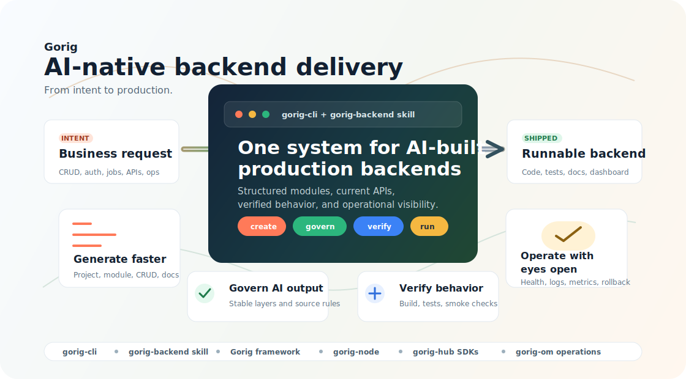

# Gorig: AI-Native Backend Delivery System [](https://deepwiki.com/jom-io/gorig)

[English](README.md) | [简体中文](README.zh-CN.md)

**Gorig** is a backend delivery system for the AI era. It combines a Go web service framework, `gorig-cli`, and the `gorig-backend` AI skill so teams can turn product intent into structured, verified, and operable backend services.

📚 **Project Wiki**: [https://deepwiki.com/jom-io/gorig](https://deepwiki.com/jom-io/gorig)  
🔧 **Operations Dashboard**: [https://github.com/jom-io/gorig-om](https://github.com/jom-io/gorig-om)



## Why Gorig

AI can generate backend code quickly, but speed alone is not enough. Real teams still need stable architecture, source-aware framework usage, tests, documentation, runtime visibility, and a path from local development to production operation.

Gorig packages those needs into one delivery workflow:

| Product value | What teams get |
|---|---|
| Ship from intent | Describe a business need such as CRUD, login, reminders, live updates, async jobs, or deployment prep, then generate a runnable Go service shape. |
| Keep AI on rails | Preserve consistent Router -> Controller -> Service -> Model boundaries instead of accepting one-off generated code. |
| Verify before trust | Treat AI output as a delivery artifact with build checks, tests, smoke verification, and generated docs. |
| Operate after launch | Use built-in patterns for health, logs, scheduling, messaging, SSE, auth, configuration, graceful shutdown, and rollback planning. |
| Grow as an ecosystem | Add `gorig-node`, `gorig-hub`, and `gorig-om` when services need discovery, SDK generation, runtime nodes, and operations visibility. |

## Delivery Workflow

Gorig is designed around the full backend lifecycle, not a single scaffolding command.

| Step | What happens |
|---|---|
| 1. Describe | Start from product language: customer management, order workflow, reminder task, admin API, service deployment. |
| 2. Scaffold | `gorig-cli` creates projects, modules, CRUD services, tests, docs, and environment configuration. |
| 3. Implement | The `gorig-backend` skill guides AI agents with real Gorig APIs, module boundaries, source checks, and framework rules. |
| 4. Verify | Generated services are expected to pass `go fmt`, `go vet`, `go build`, tests, and route-level smoke checks. |
| 5. Operate | Services can connect to operations tooling, runtime nodes, service registration, generated SDKs, and deployment workflows. |

## Ecosystem

| Project | Role |
|---|---|
| `gorig` | Go backend framework: HTTP, routing, response helpers, domain/data access, cache, cron, messaging, SSE, auth, logging, and service lifecycle. |
| `gorig-cli` | Productive entry point: initialize projects, create modules, generate CRUD, produce docs, and install AI skills. |
| `gorig-backend` skill | AI delivery guide for Codex and Claude: source-aware implementation rules, testing policy, framework references, and scenario decomposition. |
| `gorig-node` | Hub-aware service node: register service handlers and expose direct or hub-routed calls. |
| `gorig-hub` | Service registry and SDK generator: receive node metadata, manage heartbeat, and publish generated Go SDKs. |
| `gorig-om` | Operations panel: service status, configuration, logs, API latency, error signatures, goroutine trends, and memory diagnostics. |

## Quick Start

### Create a New Backend

Run without installing globally:

```sh
npx gorig-cli@latest init my-new-project --no-start
```

Or install the CLI globally:

```sh
npm install -g gorig-cli
gorig-cli init my-new-project --no-start
```

The generated project includes a runnable entry point, local/dev/prod configuration, and a dependency-light example module.

### Run the Project

```sh
cd my-new-project
GORIG_SYS_MODE=local go run ./_cmd
```

### Add a Module

```sh
npx gorig-cli@latest create user
```

This creates a flat feature module:

```text
domain/user/
├── router.go
├── controller.go
├── service.go
├── dto.go
└── model/
    └── user.go
```

### Generate Persistent CRUD

Choose the storage backend explicitly when you want database-backed CRUD:

```sh
npx gorig-cli@latest create order --crud --db mysql --db-name Main
npx gorig-cli@latest create order --crud --db mongo --db-name main
```

The CRUD generator creates service/model logic, optional HTTP routes, validation tests, module docs, API docs, and non-secret configuration skeletons.

## Use with AI Agents

Install the bundled `gorig-backend` skill when you want Codex or Claude to work with Gorig projects using framework-aware rules instead of generic backend generation.

```sh
npx gorig-cli@latest skill install codex
npx gorig-cli@latest skill install all
npx gorig-cli@latest skill install codex project
```

Then ask for backend work in product language:

```text
Use the gorig-backend skill to create a customer management backend with CRUD APIs, MySQL persistence, tests, and API docs.
```

```text
Use the gorig-backend skill to add login, protected routes, token refresh, logout, and security tests to this Gorig service.
```

```text
Use the gorig-backend skill to prepare this service for deployment with health checks, structured logs, release layout, and rollback steps.
```

## Framework Installation

If you only need the Go framework dependency:

```sh
go get github.com/jom-io/gorig@latest
```

For most new projects, start with `gorig-cli` instead of adding the package manually.

## Quality Gates

Recommended checks before shipping:

```sh
go fmt ./...
go vet ./...
go build ./...
go test ./... -v
```

For generated persistent CRUD modules, run the default tests first, then run database integration tests after local MySQL or MongoDB configuration is ready.
