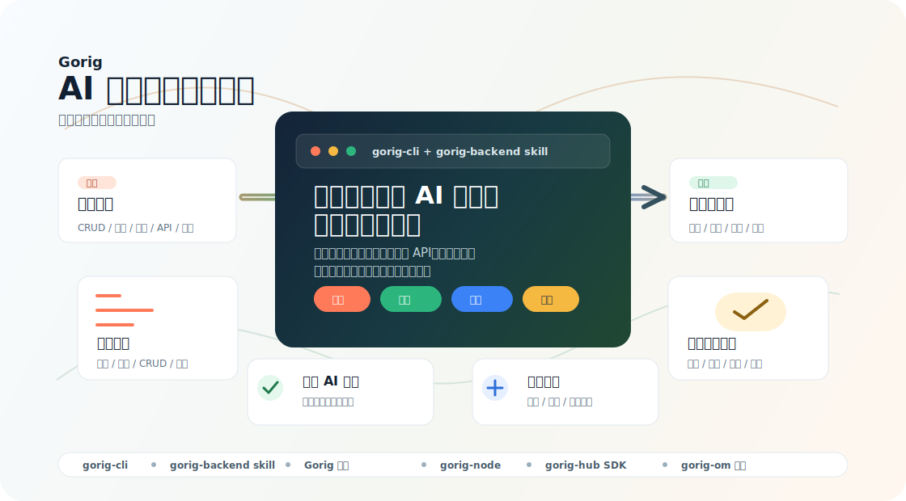

# Gorig：AI 时代后端交付体系 [](https://deepwiki.com/jom-io/gorig)

[English](README.md) | [简体中文](README.zh-CN.md)

**Gorig** 是面向 AI 时代的后端交付体系。它把 Go Web 服务框架、`gorig-cli` 和 `gorig-backend` AI Skill 组合在一起，让团队可以把产品意图转化为结构稳定、可验证、可运维的后端服务。

📚 **项目 Wiki**：[https://deepwiki.com/jom-io/gorig](https://deepwiki.com/jom-io/gorig)  
🔧 **运维面板**：[https://github.com/jom-io/gorig-om](https://github.com/jom-io/gorig-om)



## 为什么是 Gorig

AI 可以很快生成后端代码，但真实团队需要的不只是“快”。团队还需要稳定的架构边界、基于真实框架源码的 API 使用、测试、文档、运行可观测性，以及从本地开发走向生产运维的路径。

Gorig 把这些能力打包成一套可重复的后端交付流程：

| 产品价值 | 团队获得什么 |
|---|---|
| 从意图到交付 | 用业务语言描述 CRUD、登录、提醒、实时更新、异步任务或部署准备，然后生成可运行的 Go 服务结构。 |
| 让 AI 有边界 | 固化 Router -> Controller -> Service -> Model 分层，避免 AI 产出一次性的、不稳定的代码形态。 |
| 先验证再信任 | 把 AI 输出当成交付物处理：构建检查、测试、冒烟验证和文档要和代码一起产生。 |
| 上线后可运维 | 内置健康检查、日志、定时任务、消息、SSE、认证、配置、优雅退出和回滚规划等后端常见能力。 |
| 生态化扩展 | 当服务需要发现、SDK 生成、运行节点和运维可视化时，可以接入 `gorig-node`、`gorig-hub` 和 `gorig-om`。 |

## 交付流程

Gorig 关注完整后端生命周期，而不是单个脚手架命令。

| 阶段 | 发生什么 |
|---|---|
| 1. 描述需求 | 从产品语言开始：客户管理、订单流程、提醒任务、管理后台 API、服务部署。 |
| 2. 生成结构 | `gorig-cli` 创建项目、模块、CRUD 服务、测试、文档和环境配置。 |
| 3. 实现功能 | `gorig-backend` Skill 用真实 Gorig API、模块边界、源码检查和框架规则约束 AI 实现。 |
| 4. 验证结果 | 生成的服务应通过 `go fmt`、`go vet`、`go build`、测试和接口级冒烟检查。 |
| 5. 进入运维 | 服务可以连接运维工具、运行节点、服务注册、生成 SDK 和部署流程。 |

## 生态项目

| 项目 | 角色 |
|---|---|
| `gorig` | Go 后端框架：HTTP、路由、响应工具、领域/数据访问、缓存、定时任务、消息、SSE、认证、日志和服务生命周期。 |
| `gorig-cli` | 生产力入口：初始化项目、创建模块、生成 CRUD、生成文档、安装 AI Skill。 |
| `gorig-backend` skill | 面向 Codex 和 Claude 的 AI 交付指南：源码感知的实现规则、测试策略、框架参考和业务场景拆解。 |
| `gorig-node` | 面向 Hub 的服务节点：注册服务处理器，支持直连或通过 Hub 调用。 |
| `gorig-hub` | 服务注册中心与 SDK 生成器：接收节点元数据、维护心跳，并发布生成的 Go SDK。 |
| `gorig-om` | 运维面板：服务状态、配置、日志、API 延迟、错误签名、协程趋势和内存诊断。 |

## 快速开始

### 创建一个新后端

不全局安装，直接运行：

```sh
npx gorig-cli@latest init my-new-project --no-start
```

或者全局安装 CLI：

```sh
npm install -g gorig-cli
gorig-cli init my-new-project --no-start
```

生成的项目包含可运行入口、local/dev/prod 配置，以及一个轻依赖的示例模块。

### 运行项目

```sh
cd my-new-project
GORIG_SYS_MODE=local go run ./_cmd
```

### 添加模块

```sh
npx gorig-cli@latest create user
```

生成的模块采用扁平业务结构：

```text
domain/user/
├── router.go
├── controller.go
├── service.go
├── dto.go
└── model/
    └── user.go
```

### 生成持久化 CRUD

需要数据库 CRUD 时，显式选择存储后端：

```sh
npx gorig-cli@latest create order --crud --db mysql --db-name Main
npx gorig-cli@latest create order --crud --db mongo --db-name main
```

CRUD 生成器会创建 service/model 逻辑、可选 HTTP 路由、校验测试、模块文档、API 文档和非敏感配置骨架。

## 配合 AI Agent 使用

当你希望 Codex 或 Claude 按 Gorig 框架规则工作，而不是泛泛生成后端代码时，可以安装随 CLI 分发的 `gorig-backend` Skill。

```sh
npx gorig-cli@latest skill install codex
npx gorig-cli@latest skill install all
npx gorig-cli@latest skill install codex project
```

然后用产品语言提出需求：

```text
使用 gorig-backend skill，创建一个客户管理后端，包含 CRUD 接口、MySQL 持久化、测试和 API 文档。
```

```text
使用 gorig-backend skill，为这个 Gorig 服务增加登录、受保护路由、Token 刷新、退出登录和安全测试。
```

```text
使用 gorig-backend skill，把这个服务整理到可部署状态：补充健康检查、结构化日志、发布目录和回滚步骤。
```

## 框架依赖安装

如果只需要 Go 框架依赖：

```sh
go get github.com/jom-io/gorig@latest
```

多数新项目建议从 `gorig-cli` 开始，而不是手动添加包依赖。

## 质量检查

交付前建议执行：

```sh
go fmt ./...
go vet ./...
go build ./...
go test ./... -v
```

对于生成的持久化 CRUD 模块，先运行默认测试；本地 MySQL 或 MongoDB 配置就绪后，再运行数据库集成测试。
